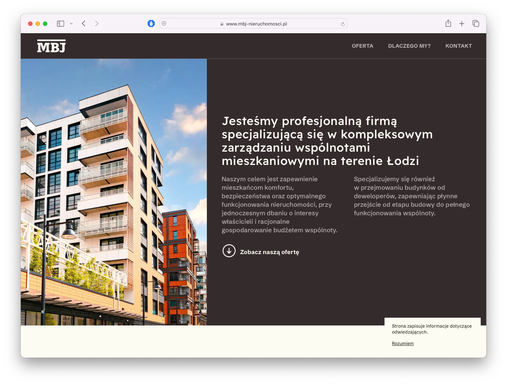
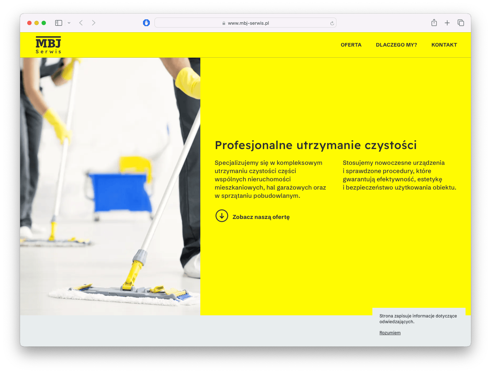

# MBJ — Dual-site Astro Setup

Two static websites built from a single repository, sharing components and assets.
Each site has its own Astro config, source directory, and build output.




| Site | srcDir | outDir |
|---|---|---|
| Administracja | `./administracja` | `./dist/administracja` |
| Serwis | `./serwis` | `./dist/serwis` |

Assets are built once (administracja) and referenced by serwis via `assetsPrefix` in production.

## Structure

```bash
src/
├── components/   # Shared Astro components
├── layouts/      # Shared layouts
├── themes/       # Per-site theme variants
└── assets/       # Shared styles, scripts, images
administracja/    # Pages and content for site 1
serwis/           # Pages and content for site 2
```

## Scripts

```bash
npm run dev              # dev server for administracja
npm run dev:serwis       # dev server for serwis
npm run build:prod       # build both sites
```

## Stack
Astro - GSAP - TypeScript
